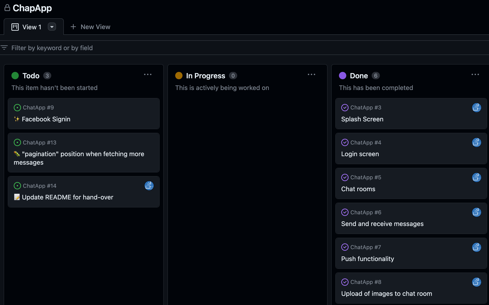

# Code Challenge

Created a github project for the code challenge

## Project setup



Created issues for all the user stories

- [#3 Splash Screen](https://github.com/Norfeldt/ChatApp/issues/3)
- [#4 Login Screen](https://github.com/Norfeldt/ChatApp/issues/4)
- [#5 Chat rooms](https://github.com/Norfeldt/ChatApp/issues/5)
- [#6 Send and receive messages](https://github.com/Norfeldt/ChatApp/issues/6)
- [#8 Upload of images to chat room](https://github.com/Norfeldt/ChatApp/issues/8)
- [#7 Push functionality](https://github.com/Norfeldt/ChatApp/issues/7)

## Project flow

To understand how the code base evolved, you can review the [pull requests in ascending order.](https://github.com/Norfeldt/ChatApp/pulls?q=is%3Apr+is%3Aclosed+sort%3Acreated-asc) 

Did not add Facebook signin in since I had to stop before the agreed deadline due to other meetings taking up my time. Agreed with Henrik that it's okay and created an new user story (issue) for this task ([✨ Facebook Signin](https://github.com/Norfeldt/ChatApp/issues/9)) 

Encountered an issue with the scroll view and pagination. Trying to resolve it became time consuming so created (🐛 "pagination" position when fetching more messages)[https://github.com/Norfeldt/ChatApp/issues/13] bug issue for it.

## Notes to reviewer

**Expo Usage**: I'm accustomed to using Expo for developing React Native apps, especially since they dropped the eject feature.

**Firebase**: Firebase is used as the backend. Firestore is used for the database, and Firebase Authentication is used for user authentication.

**Testing**: The app has been tested on an iPhone 11 Pro and an Android emulator. Haven't made a test setup but would prefer to have some for the CI/CD and future maintenance.

**Dependencies**: All dependencies are listed in the package.json file.

**Environment Variables**: Environment variables are stored in a .env file, which is not included in the repository. 

**Not Committed Fires**:

- google-services.json  `android/app/google-services.json`
- GoogleService-Info.plist `ios/GoogleService-Info.plist`
  
You need to request them from me.


### repo structure

```
.
├── App.tsx
├── Gemfile
├── Gemfile.lock
├── README.md
├── __tests__
│   └── App.test.tsx
├── app.json
├── assets
│   ├── bootsplash_logo.png
│   ├── bootsplash_logo@1,5x.png
│   ├── bootsplash_logo@2x.png
│   ├── bootsplash_logo@3x.png
│   ├── bootsplash_logo@4x.png
│   ├── bootsplash_logo_original.png
│   └── github-project-example.png
├── babel.config.js
├── index.js
├── jest.config.js
├── jwt.sh
├── metro.config.js
├── package.json
├── react-native.config.js
├── requests.rest
├── seed.json
├── src
│   ├── components
│   │   ├── Loading.tsx
│   │   ├── MessageForm.tsx
│   │   ├── MessageList.tsx
│   │   ├── PushNotificationSubscriptionDialog.tsx
│   │   ├── PushNotificationWrapper.tsx
│   │   ├── SignOutButton.tsx
│   │   └── UploadImage.tsx
│   ├── hooks
│   │   ├── useChatRooms.ts
│   │   ├── useMessages.ts
│   │   └── useUserInfo.ts
│   ├── screens
│   │   ├── ChatRoomsScreen.tsx
│   │   ├── ChatScreen.tsx
│   │   └── LoginScreen.tsx
│   ├── types
│   │   └── server.d.ts
│   └── utils
│       └── firebaseFunctions.ts
├── tsconfig.json
├── types.d.ts
└── yarn.lock
```


### Coding style:


Haven't added many code comments since I try to use explaining names and logic. So it's easier for my colleagees and future me to participate in adding new features.

like to use named exports since renaming with vscode is more safe.

Did not focus on global state management and caching (only did a little caching to avoid requesting the same user information).

Made a simple UI without a chat library.


### Firebase backend

Started out trying to keep the database simple (since it's a code challenge) by using the realtime database, but had to refactor it to using firestore. 

```
# Firebase Firestore

## Structure

Firestore Database: chatapp-6c027
|
├── users (Collection)
|   |
|   ├── [uid] (Document)
|   |   |
|   |   └── fcmTokens: string[]
|   |
|   └── ... (Other users)
|
└── chatRooms (Collection)
    |
    ├── [chatRoomId] (Document)
    |   |
    |   ├── name: string
    |   ├── description: string
    |   ├── lastMessageTimestamp: number
    |   ├── members: array of user uids
    |   ├── pushNotificationSubscribers: array of user uids
    |   |
    |   └── messages (Sub-collection)
    |       |
    |       ├── [messageId] (Document)
    |       |   |
    |       |   ├── uid: string
    |       |   ├── text: string
    |       |   ├── timestamp: number
    |       |   └── image?: string
    |       |
    |       └── ... (Other messages)
    |
    └── ... (Other chat rooms)
```


I created a separate repo for the firebase backend so I could seed the database and deploy firebase functions.

```js
.
├── firebase.json
├── firestore
│   ├── README.md
│   ├── package.json
│   ├── src
│   │   └── seedFirestore.ts
│   ├── tsconfig.dev.json
│   ├── tsconfig.json
│   └── yarn.lock
├── firestore.indexes.json
├── firestore.rules
├── functions
│   ├── lib
│   │   ├── index.js
│   │   └── index.js.map
│   ├── package.json
│   ├── src
│   │   └── index.ts
│   ├── tsconfig.dev.json
│   ├── tsconfig.json
│   └── yarn.lock
├── remoteconfig.template.json
├── serviceAccount.json
└── storage.rules
```

> ./firestore/src/seedFirestore.ts

```ts
import { LoremIpsum } from 'lorem-ipsum'
import admin from 'firebase-admin'
import serviceAccount from '../../serviceAccount.json'

admin.initializeApp({
  credential: admin.credential.cert({
    projectId: serviceAccount.project_id,
    clientEmail: serviceAccount.client_email,
    privateKey: serviceAccount.private_key,
  }),
})

const db = admin.firestore()

const deleteMessagesCollection = async (roomId: string) => {
  const messagesRef = db.collection('chatRooms').doc(roomId).collection('messages')
  const messagesSnapshot = await messagesRef.get()

  const batch = db.batch()
  messagesSnapshot.docs.forEach((doc) => {
    batch.delete(doc.ref)
  })

  await batch.commit()
}

const chatrooms = [
  {
    id: 'expo-vs-bare',
    name: 'expo vs bare 🧟‍♂️',
    description: 'Discussing Expo vs Bare React Native',
  },
  { id: 'button-color', name: 'button color 🔘', description: 'Discussing button colors' },
  { id: 'random', name: 'random 🎲', description: 'Discussing random stuff' },
]
const users = [
  { uid: 'y0LIXdA6kPe4jArabJ2YIFVZDdk1', fcmTokens: [] },
  { uid: 'UNgmJu75rnMfcQhtvFMAhd2NHCA3', fcmTokens: [] },
]

const seedUsers = async () => {
  for (const user of users) {
    const userRef = db.collection('users').doc(user.uid)
    const { uid, ...userWithoutUid } = user
    await userRef.set(userWithoutUid)
  }
}

let seed = 1
function deterministicRandom(): number {
  const x = Math.sin(seed++) * 10000
  return x - Math.floor(x)
}
const lorem = new LoremIpsum({
  random: deterministicRandom,
})
const fixTimestamp = 1692144030000

const seedChatrooms = async () => {
  await seedUsers()

  for (const [index, room] of chatrooms.entries()) {
    let messages: Message[] = []
    const messageCount = room.id === chatrooms[0].id ? 65 : 10
    for (let i = 0; i < messageCount; i++) {
      // all users are members of all chat rooms except the last room which only has one user
      const uid = index != chatrooms.length - 1 ? users[i % 2].uid : users[1].uid
      messages.push({
        uid,
        text: lorem.generateSentences(1),
        timestamp: fixTimestamp + i * 1000,
      })
    }
    if (room.id === chatrooms[1].id) {
      messages[messages.length - 1].image = 'images/bootsplash_logo.png'
    }
    if (room.id === chatrooms[0].id) {
      messages[messages.length - 50].text = '📃 Message no. 50 📌'
    }

    console.log(`Seeding ${messages.length} messages for room ${room.id}`)
    const roomRef = db.collection('chatRooms').doc(room.id)
    await roomRef.set({
      ...room,
      lastMessageTimestamp: messages[messages.length - 1].timestamp,
      members: messages.reduce((acc, message) => {
        if (!acc.includes(message.uid)) {
          acc.push(message.uid)
        }
        return acc
      }, [] as string[]),
      pushNotificationSubscribers: messages.reduce((acc, message) => {
        if (!acc.includes(message.uid)) {
          acc.push(message.uid)
        }
        return acc
      }, [] as string[]),
    } satisfies ChatRoom)
    await deleteMessagesCollection(room.id)
    const messagesRef = roomRef.collection('messages')
    // Ensure all messages are added before moving to the next chatroom
    await Promise.all(messages.map((message) => messagesRef.add(message)))
  }
}

seedChatrooms()
  .then(() => {
    console.log('Seeding completed!')
    process.exit(0)
  })
  .catch((error) => {
    console.error('Error seeding data:', error)
  })

// TODO: use mono-repo or other way to share types than manual copy-paste
type ChatRoom = {
  name: string
  description: string
  lastMessageTimestamp: number
  members: string[]
  pushNotificationSubscribers: string[]
}

type Message = {
  uid: string
  text: string
  timestamp: number
  image?: string
}
```

> ./functions/src/index.ts

```ts
import * as functions from 'firebase-functions'
import * as admin from 'firebase-admin'
admin.initializeApp()

export const getUserInfo = functions.https.onCall(async (data, context) => {
  if (!context.auth) {
    throw new functions.https.HttpsError('unauthenticated', 'User must be authenticated')
  }

  const { uid } = data
  try {
    const userRecord = await admin.auth().getUser(uid)
    return {
      displayName: userRecord.displayName ?? 'Unknown',
      photoURL: userRecord.photoURL ?? 'https://placekitten.com/200/200',
    }
  } catch (error) {
    console.error('Error fetching user data:', error)
    throw new functions.https.HttpsError('internal', 'Unable to fetch user data')
  }
})

export const sendMessage = functions.https.onCall(
  async (data: { roomId: string } & Pick<Message, 'text' | 'image'>, context) => {
    if (!context.auth) {
      throw new functions.https.HttpsError('unauthenticated', 'User must be authenticated')
    }

    const { roomId, ...message } = data
    const uid = context.auth.uid
    await admin
      .firestore()
      .collection(`chatRooms/${roomId}/messages`)
      .add({
        ...message,
        uid,
        timestamp: admin.firestore.Timestamp.now().toMillis(),
      } satisfies Message)

    return { success: true }
  }
)

export const onNewMessage = functions.firestore
  .document('chatRooms/{roomId}/messages/{messageId}')
  .onCreate(async (snapshot, context) => {
    const { timestamp, uid, text: body } = snapshot.data() as Message
    const roomId = context.params.roomId

    // Update chatroom's lastMessageTimestamp
    await admin
      .firestore()
      .collection('chatRooms')
      .doc(roomId)
      .update({
        lastMessageTimestamp: timestamp,
        members: admin.firestore.FieldValue.arrayUnion(uid),
      })

    // Send push notifications to all subscribers
    const userRecord = await admin.auth().getUser(uid)
    const chatRoomRef = admin.firestore().collection('chatRooms').doc(roomId)
    const chatRoomDoc = await chatRoomRef.get()
    const pushNotificationSubscribers = chatRoomDoc.data()?.pushNotificationSubscribers ?? []
    const tokens: string[] = []
    for (const uid of pushNotificationSubscribers) {
      const userRef = admin.firestore().collection('users').doc(uid)
      const userDoc = await userRef.get()
      const fcmTokens = userDoc.data()?.fcmTokens ?? []
      tokens.push(...fcmTokens)
    }

    const payload = {
      notification: {
        title: `${userRecord.displayName} 💬`,
        body,
      },
      data: {
        roomId,
      },
    }

    if (tokens.length > 0) {
      await admin.messaging().sendEachForMulticast({ tokens, ...payload })
    }
  })

export const subscribeToChatRoom = functions.https.onCall(
  async (data: { roomId: string }, context) => {
    if (!context.auth) {
      throw new functions.https.HttpsError('unauthenticated', 'User must be authenticated')
    }

    const chatRoomRef = admin.firestore().collection('chatRooms').doc(data.roomId)
    await chatRoomRef.update({
      pushNotificationSubscribers: admin.firestore.FieldValue.arrayUnion(context.auth.uid),
    })

    return { success: true }
  }
)

// TODO: use mono-repo or other way to share types than manual copy-paste
// @ts-expect-error
type ChatRoom = {
  name: string
  description: string
  lastMessageTimestamp: number
  members: string[]
  pushNotificationSubscribers: string[]
}

type Message = {
  uid: string
  text: string
  timestamp: number
  image?: string
}

```

